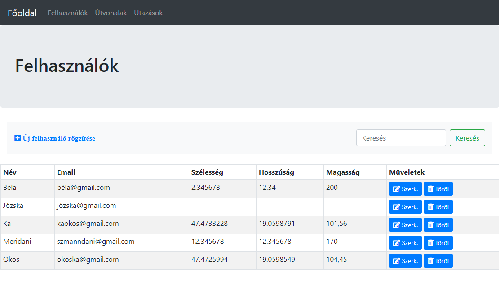

# [Info2_Nagyhazi]((https://github.com/meridani/Info2_Nagyhazi))

Ez az alkalmazás képes Felhasználók pozícióit és korábbi utazásait nyílvántartani.

#Specifikáció
##Alkalmazás leírása

##Elérhető funkciók
* Felhasználók 
  * Létrehozása
  * Frissétése
  * Törlése
  * Szűrés név vagy email szerint
  
* Útvonalak
  * Létrehozása
  * Amennyiben a kezdő vagy a végső cél már létezik az adatbázisban akkor annak a használata vagy új létrehozása
  * Szűrés név szerint
  
* Utazások
  * Új utazás rögzítése a már az adatbázisban szereplő felhasználók és útvonalak listájából
  * Felhasználó megadása nem kötelező
  * Szűrése útvonal névre vagy felhasználó névre
  
  
Az adatbázis a következő sémára épül:

